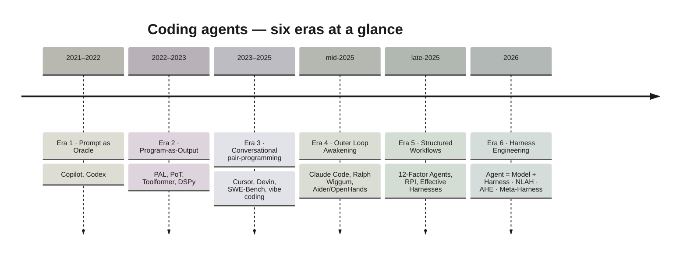
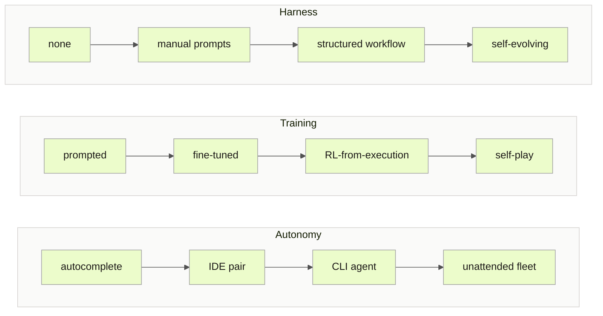
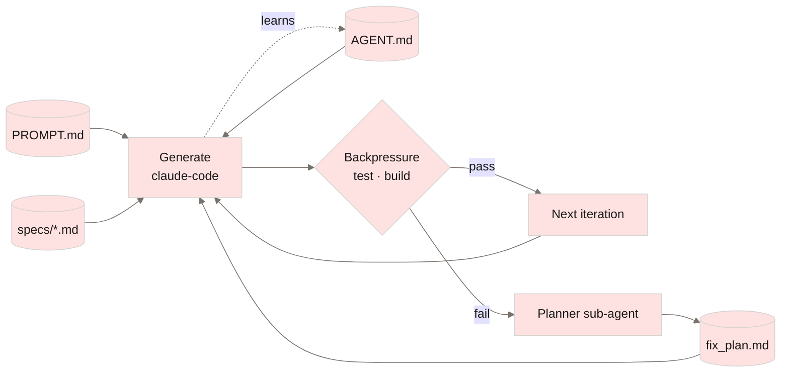
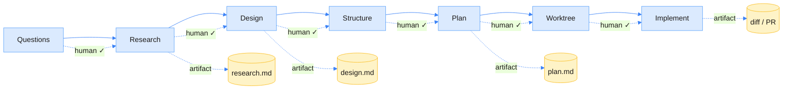
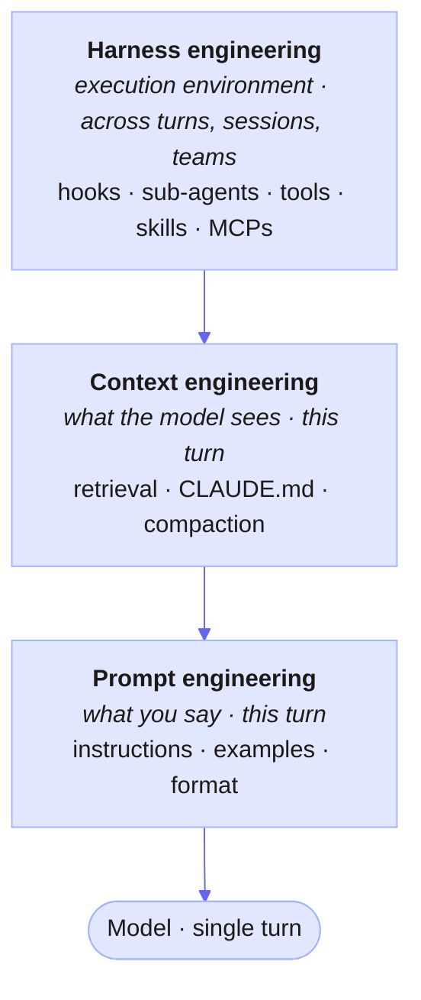
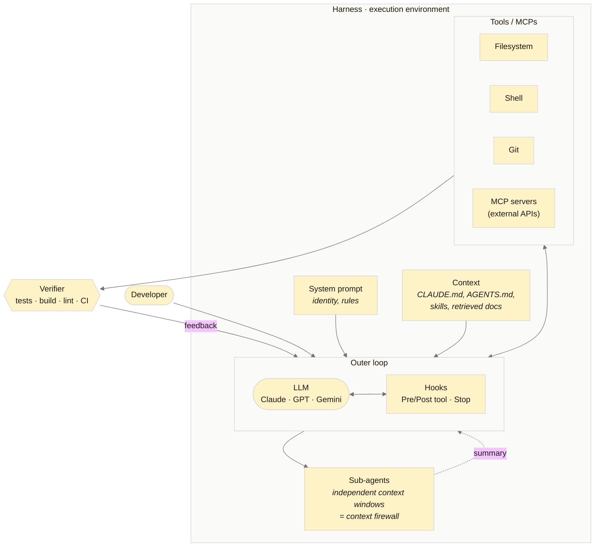
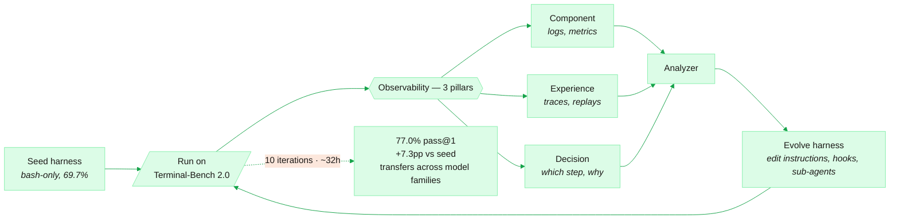
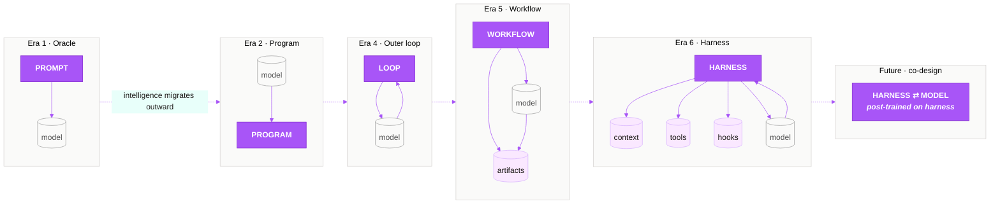

# The Evolution of Coding Agents

**From Copilot to Self-Evolving Harnesses, 2021–2026 (and beyond)**

> A community-maintained reference document tracing the conceptual and technical evolution of AI-assisted coding agents — and where the field is heading next. Verified references throughout.

This is the full essay. For repository orientation, source-audit notes, and contribution guidelines, see the root [README](../README.md), [references](references.md), [verification log](verification-log.md), and [contributing guide](contributing.md).

---

## Table of contents

- [Abstract](#abstract)
- [Conceptual frame: three orthogonal axes](#conceptual-frame-three-orthogonal-axes)
- [Working vocabulary](#working-vocabulary)
- [Era 1: Prompt as Oracle (2021 – mid-2022)](#era-1-prompt-as-oracle-2021--mid-2022)
- [Era 2: Program-as-Output (late 2022 – 2023)](#era-2-program-as-output-late-2022--2023)
- [Era 3: Conversational Pair-Programming and First Agentic Attempts (2023 – early 2025)](#era-3-conversational-pair-programming-and-first-agentic-attempts-2023--early-2025)
- [Era 4: The Outer Loop Awakening (mid-2025)](#era-4-the-outer-loop-awakening-mid-2025)
- [Era 5: Structured Workflows (mid-2025 – early 2026)](#era-5-structured-workflows-mid-2025--early-2026)
- [Era 6: Harness Engineering (early 2026)](#era-6-harness-engineering-early-2026)
- [The parallel branch: RL for coding agents](#the-parallel-branch-rl-for-coding-agents)
- [The multi-agent debate (2025–2026)](#the-multi-agent-debate-20252026)
- [Where the frontier actually is (2026)](#where-the-frontier-actually-is-2026)
- [Why this matters beyond coding](#why-this-matters-beyond-coding)
- [Conceptual throughline: where intelligence lives](#conceptual-throughline-where-intelligence-lives)
- [Open problems](#open-problems)
- [What survived each era](#what-survived-each-era)
- [Suggested reading order](#suggested-reading-order)
- [References](#references)

---

## Abstract

This document traces the evolution of AI-assisted coding agents from the launch of GitHub Copilot in 2021 through the formalization of *harness engineering* as a discipline in early 2026, and out to the active research frontier as of May 2026. We identify six conceptually distinct eras, each defined by a shift in **where the intelligence of the system is understood to live**: from the prompt itself, to compiled programs, to multi-turn conversations, to outer loops with formal verifiers, to structured workflows with persistent artifacts, and finally to designed harnesses surrounding the model. Two parallel branches — **RL on coding agents** and the **multi-agent debate** — run alongside this main thread and are now reconverging with it through model-harness co-design (GLM-5/5.1, Self-Play SWE-RL) and self-evolving harnesses (AHE, NLAH, AutoHarness, Meta-Harness). We provide verified references — including arXiv papers with identifiers and dates, primary blog posts, and industry case studies — and document the open problems that remain, particularly around verification, benchmark validity, and the application of these techniques outside software engineering.

A note on framing: the dominant narrative in 2026 commentary is **"structure around the model matters more than cleverness inside the model."** This is a useful heuristic and the throughline of this document — but the strong version is empirically false. Model jumps (Opus 4.5 → 4.7, GPT-5 → 5.4, GLM-5 → 5.1) deliver double-digit benchmark gains with the harness held fixed, just as harness improvements deliver them with the model fixed. The honest position is that **model and harness are partial substitutes in the capability space; both matter, and the interesting question is how marginal returns reallocate as each side improves**. We try to flag where the document leans toward the structuralist thesis so readers can calibrate.



---

## Conceptual frame: three orthogonal axes

Before diving into eras, it helps to recognize that "coding agents" evolve along **three orthogonal axes**, not one timeline:

| Axis | Range |
|---|---|
| **Autonomy** | autocomplete → IDE pair → CLI agent → unattended fleet |
| **Training** | prompted → fine-tuned → RL-from-execution → self-play |
| **Harness** | none → manual prompts → structured workflow → self-evolving |



The "eras" below are diagonal trajectories through this cube, not points on a line. Cursor (2023) and Claude Code (2025) coexist; Aider, OpenHands, and Codex CLI evolve in parallel. The taxonomy is a narrative simplification, useful but opinionated. See [Era 6.7](#67-critique-of-the-paradigm) for the serious counterarguments.

---

## Working vocabulary

This document uses a few terms that are overloaded in current agent discourse. The definitions below are deliberately operational: they describe what a builder would actually configure, measure, or debug.

| Term | Working definition |
|---|---|
| **Coding agent** | A model-driven system that can inspect code, decide on actions, use tools, modify files, and respond to feedback. Autocomplete is not yet an agent; a CLI system that edits files, runs tests, and iterates is. |
| **Harness** | The designed execution environment around the model: tools, permissions, context, prompts, hooks, memory, workflow, sub-agents, tests, and feedback loops. If the model is the reasoning engine, the harness is the operating environment that makes its work repeatable and inspectable. |
| **Outer loop** | A repeated cycle around the model, usually `generate -> verify -> repair -> repeat`. In coding, the loop can use cheap feedback from compilers, tests, type checkers, linters, and CI. Ralph-style systems are a minimal example of this idea. |
| **Verifier** | Any mechanism that can judge work more cheaply or reliably than the model can generate it. In software this might be a compiler, test suite, type checker, linter, static analyzer, formal proof checker, or CI pipeline. The absence of cheap verifiers is why these techniques transfer poorly to many legal, medical, financial, or scientific workflows. |
| **Prompt engineering** | Choosing the instruction given to the model for a turn. It controls what is asked. It does not, by itself, define the tools, state, permissions, or feedback loop around the model. |
| **Context engineering** | Choosing what information the model sees, in what form, at what time, and with what priority. Examples: repo summaries, retrieved files, `AGENTS.md`, previous decisions, compressed history, issue context, and relevant docs. |
| **Harness engineering** | Designing the full system around the model across turns and sessions. It includes prompt and context engineering, but also tool contracts, hooks, sub-agent boundaries, persistent artifacts, observability, evals, and verification gates. |
| **Persistent artifact** | A file or structured object that carries state across agent sessions: plans, specs, progress notes, feature lists, decision logs, `CLAUDE.md`, `AGENTS.md`, or generated eval reports. Persistent artifacts compensate for limited and lossy conversation context. |
| **Sub-agent** | A delegated agent with its own context window and usually a narrower task. The important property is not "more agents" but isolation: a sub-agent can research, evaluate, or summarize without polluting the main context. |
| **Hook** | Deterministic code that runs before or after an agent action. Hooks can block dangerous commands, format files, run tests, collect traces, enforce policy, or inject feedback. They are where ordinary software engineering re-enters an otherwise probabilistic system. |
| **MCP** | Model Context Protocol: a standard interface for connecting agents to external tools, data, and services. In this document, MCP matters because it expands what agents can do, but also expands the security surface. |
| **RLVR** | Reinforcement learning with verifiable rewards. The model improves by receiving rewards from outcomes that can be checked automatically, such as passing tests or producing a correct proof. Coding is unusually suitable for RLVR because many rewards are executable. |
| **Benchmark contamination** | A benchmark loses validity when tasks, solutions, or close variants appear in model training data or public scaffolds. The model may then score well without demonstrating the intended generalization. |
| **Self-evolving harness** | A harness that modifies its own instructions, workflow, tools, memory, or evaluation process based on traces and failures. The key question is whether those changes generalize or merely overfit the benchmark. |

These terms explain why the story is not just "models got better." Model quality matters, but the same model can behave very differently depending on what it can see, what it can do, how failures are observed, and how the surrounding system converts those failures into the next action.

---

## Era 1: Prompt as Oracle (2021 – mid-2022)

The earliest wave treated the LLM as a single-shot oracle. You gave it a prompt, it gave you code. **GitHub Copilot** — released as a technical preview in June 2021 and made generally available in June 2022 — defined this era. Powered by OpenAI Codex [\[1\]](#ref-1), Copilot was effectively autocomplete on steroids. The skill being optimized was prompt crafting; the system around the model barely existed.

**What made Copilot unique** wasn't the model (Codex was already an OpenAI API). Three factors:

1. **IDE integration** in VS Code/JetBrains via LSP-like protocol — instant mass distribution.
2. **Ghost-text UX** (in-line gray suggestion + Tab to accept) that minimized cognitive friction.
3. **Industrial-scale telemetry**: by 2025, ~150M developers were using Copilot, generating the corpus to iterate the model rapidly.

**Predecessors that mattered**: Tabnine (2018, Jacob Jackson at Waterloo) launched the first commercial transformer-backed code completion; Deep TabNine (2019) used a fine-tuned GPT-2 on ~2M GitHub files, predating Copilot by ~2 years. Kite (2014–2022) used pre-LLM ML and shut down in November 2022, with founders explicitly stating *"we failed to deliver our vision of AI-assisted programming"* — a useful data point that, in this era, the model did matter.

**Failure mode**: anything beyond a single function fell apart, with no feedback loop available to recover from errors. The model was treated as a function from prompt to code, with no provision for iteration, verification, or context accumulation. The Codex paper itself foreshadowed the escape: with `n=100` repeated samples, pass rate climbed from 28.8% to 70.2% [\[1\]](#ref-1), which prefigured the test-time-compute regime that would dominate 2024–2026.

### Foundational reference

- Chen et al., *"Evaluating Large Language Models Trained on Code"* (the Codex paper), arXiv:2107.03374, 7 July 2021. [\[1\]](#ref-1)

---

## Era 2: Program-as-Output (late 2022 – 2023)

The conceptual breakthrough of late 2022 was simple but consequential: instead of asking the LLM to *answer*, ask it to *write a program that answers*. The LLM becomes a frontend that produces an intermediate representation; classical execution does the heavy lifting. This re-introduces determinism through the side door.

Two papers defined this era almost simultaneously, both in November 2022:

- **PAL (Program-Aided Language Models)** — Gao, Madaan, Zhou et al. at Carnegie Mellon (arXiv:2211.10435, 18 November 2022) [\[2\]](#ref-2). PAL was later accepted at ICML 2023.
- **PoT (Program of Thoughts)** — Chen, Ma, Wang, and Cohen (arXiv:2211.12588, 22 November 2022) [\[3\]](#ref-3). Independent parallel work with the same core insight.

Both showed that delegating computation to a Python interpreter consistently outperformed having the LLM compute answers directly.

Adjacent work extended the same principle to other domains:

- **Code as Policies** — Liang et al. at Google Robotics (arXiv:2209.07753, September 2022, ICRA 2023) [\[4\]](#ref-4) applied program-as-output to robot control. (Tangential to coding agents proper, but conceptually adjacent.)
- **Parsel** — Zelikman et al. at Stanford (arXiv:2212.10561, December 2022) [\[5\]](#ref-5) introduced hierarchical decomposition through a natural-language-flavored DSL. NeurIPS 2023.
- **DSPy** — Khattab et al. (arXiv:2310.03714, October 2023) [\[6\]](#ref-6) formalized the *compilation* of declarative prompt programs into optimized runtime artifacts — closing the loop with classical compiler theory.

Two foundational pieces commonly omitted from this era's narrative:

- **Chain-of-Thought** — Wei et al. (arXiv:2201.11903, January 2022) [\[7\]](#ref-7). The substrate on which PAL, PoT, ReAct, and Reflexion all build.
- **Toolformer** — Schick et al. at Meta (arXiv:2302.04761, February 2023, NeurIPS 2023) [\[8\]](#ref-8). Showed an LLM could **self-supervise its own dataset** of API calls (calculator, Q&A, search, calendar), pivoting Era 2 toward Era 3's tool-use paradigm.

Adjacent practitioner work also emerged: **SUDOLANG** by Eric Elliott (2023), an NL-flavored DSL designed to be "compiled" by LLMs.

The era was conceptually rich but largely confined to research. Its underlying philosophy — that natural language is a lossy frontend best paired with formal execution — would resurface throughout the next four years as the foundational argument behind harness engineering.

---

## Era 3: Conversational Pair-Programming and First Agentic Attempts (2023 – early 2025)

Cursor, Cody, Aider, and Continue.dev defined the dominant interaction model: the developer drives, the AI bats back. Multi-turn conversations replaced single prompts. RAG over codebases became standard. The mental model was *table tennis*: prompt, response, adjust.

In parallel, the first wave of "autonomous agents" emerged — AutoGPT, BabyAGI, and similar projects — popularizing the idea of LLM-driven loops, but failing to ship reliable production systems. As Dex Horthy would later observe, most products billing themselves as "AI agents" in this period were *"mostly deterministic code, with LLM steps sprinkled in at just the right points to make the experience truly magical."*

### 3.1 The first benchmark for real software engineering

A pivotal artifact: **SWE-bench** (Jimenez, Yang, Wettig, Yao, Pei, Press, Narasimhan — Princeton/Chicago), released 10 October 2023 (arXiv:2310.06770) [\[9\]](#ref-9) and accepted at ICLR 2024. SWE-bench evaluated whether language models could resolve real-world GitHub issues across twelve popular Python repositories. The initial result was sobering: the best-performing model, Claude 2, solved only 1.96% of issues.

**SWE-bench Verified** — a 500-task human-validated subset — was released in collaboration with OpenAI on 13 August 2024 [\[10\]](#ref-10). It became the gold standard benchmark for autonomous coding agents through 2025. By February 2026, however, OpenAI itself **deprecated SWE-bench Verified** [\[11\]](#ref-11), citing both contamination concerns (post-2024 models had likely seen the solutions during training) and excessive scaffolding-dependence (the same model could score 69% standalone or 81% with sophisticated harnessing). State-of-the-art progress had slowed from 74.9% to 80.9% in six months. The benchmark's lifecycle thus mirrors the broader narrative: as harnesses became central, they began to dominate the very metrics meant to measure model capability. OpenAI's stated successor is **SWE-bench Pro** (Scale AI, September 2025).

### 3.2 Devin and the first "AI software engineer" hype cycle

On **12 March 2024**, Cognition Labs announced **Devin**, marketed as the "first AI software engineer" [\[12\]](#ref-12). Devin's announced **13.86% on SWE-bench (full, 2,294 tasks)** — versus the prior 1.96% state of the art — helped catalyze investment and attention in the autonomous-agent space. (Note: the score was on SWE-bench full, not Verified, which did not yet exist.) Despite controversy over the demo's accuracy — independent reviewers documented several discrepancies — Devin's launch is widely credited with accelerating both investment and adversarial debate around the autonomous-agent paradigm.

Two later artifacts from Cognition shaped industry thinking on multi-agent design:

- **"Don't Build Multi-Agents"** by Walden Yan (12 June 2025) [\[13\]](#ref-13), arguing that parallel sub-agents make implicit conflicting decisions and produce fragile systems. The post triggered a public exchange with Anthropic, which on 13 June 2025 published *How we built our multi-agent research system* — appearing to take the opposite position.
- **"Multi-Agents: What's Actually Working"** by Walden Yan (April 2026) [\[14\]](#ref-14), a refinement of the position: Devin v2 introduces manager + child Devins coordinating via internal MCP, but unstructured swarms remain rejected and writes stay single-threaded. The two posts read together capture a productive industry disagreement that resolved into nuance rather than consensus. See [the multi-agent debate section](#the-multi-agent-debate-20252026) for the full state of play.

### 3.3 The cultural thread: "vibe coding"

On **2 February 2025** (18:17 UTC), Andrej Karpathy posted a brief X thread coining the term *vibe coding* [\[15\]](#ref-15):

> There's a new kind of coding I call vibe coding, where you fully give in to the vibes, embrace exponentials, and forget that the code even exists.

The post received over 4.5 million views and *vibe coding* was named Collins Dictionary's Word of the Year 2025. Simon Willison wrote a widely-cited clarification in March 2025 [\[16\]](#ref-16) arguing that not all AI-assisted programming is vibe coding — vibe coding specifically denotes building software with an LLM *without reviewing the code it writes*, in contrast to professional AI-assisted development. The semantic drift of the term over 2025 itself became a story: by late 2025, developers on LinkedIn were jokingly renaming themselves "Vibe Code Cleanup Specialists," and Merriam-Webster's competing Word of the Year was *slop* — a deliberate counterpoint. Notably, ~25% of YC's Winter 2025 batch had codebases that were 95% AI-generated, and Sundar Pichai stated >30% of Google's new code was AI-assisted.

### 3.4 The market: Cursor and the corporate offerings

The economic story of Era 3 is dominated by Cursor (Anysphere). Funding trajectory: October 2023 seed $8M (OpenAI Startup Fund) → August 2024 Series A $60M @ $400M → December 2024 $100M @ $2.5B → June 2025 $900M @ $9.9B → November 2025 $2.3B @ $29.3B → ongoing $2B @ $50B discussions in April 2026. Cursor went from $0 to $2B ARR in 3 years — the **fastest B2B scaling on record**, surpassing Slack, Zoom, and Snowflake [\[17\]](#ref-17). This complicates strong versions of the "harness is the moat" thesis: distribution and product-market fit are also moats.

Adjacent market developments:

- **Sourcegraph Cody**: differentiated with graph-based code search and on-prem enterprise deployment.
- **Codeium → Windsurf**: 2024 rebrand, ~$3B partial OpenAI acquisition in 2025; remaining Windsurf team acquired by Cognition in July 2025.
- **Replit Ghostwriter → Replit Agent**: early "build the whole app from a prompt" experience that introduced Karpathy to vibe coding.
- **Tabnine evolution**: pivoted to enterprise (on-prem, air-gapped, 600+ languages).
- **GitHub Copilot Workspace** (April 2024): Microsoft's first agentic inner-loop attempt; tepid adoption next to Cursor.
- **Microsoft AutoDev, Google Codey/Jules, Amazon Q Developer Agent**: corporate offerings developed in parallel.

### 3.5 Other Era 3 milestones

- **ReAct** — Yao et al., arXiv:2210.03629, October 2022 [\[18\]](#ref-18). The foundational *reason-act-observe* loop underlying most subsequent agentic systems. (Conceptually Era 2; pragmatically the spine of Era 3's agents.)
- **Reflexion** — Shinn et al., arXiv:2303.11366, March 2023 [\[19\]](#ref-19). Self-reflection with verbal feedback as a recovery mechanism. NeurIPS 2023.
- **Voyager** — Wang et al. (NVIDIA/Caltech), arXiv:2305.16291, May 2023 [\[20\]](#ref-20). Agent skill libraries indexed by embeddings; 3.3× more unique items, 15.3× faster to wooden tier in Minecraft. Conceptual ancestor of Era 6's self-evolving agents.
- **SWE-Agent** — Yang et al., arXiv:2405.15793, May 2024 [\[21\]](#ref-21). The first agent-computer interface specifically designed for SWE-bench, achieving state-of-the-art performance. NeurIPS 2024.
- **OpenHands** (formerly OpenDevin, All-Hands-AI, arXiv:2407.16741) [\[22\]](#ref-22) — open-source response to Devin, ~April 2024. By November 2025 reached SOTA on SWE-Bench Verified with inference-time scaling + critic model.
- **AutoGen** (Microsoft Research, October 2023): multi-agent framework that, alongside MetaGPT and CrewAI, started the multi-agent branch. **OpenAI Swarm** (October 2024) → evolved into **OpenAI Agents SDK**.

---

## Era 4: The Outer Loop Awakening (mid-2025)

Two events in 2025 crystallized the field's understanding of where agent intelligence actually lives.

### 4.1 Claude Code

Anthropic released **Claude Code** as a research preview on **24 February 2025**, with general availability in **May 2025**. Unlike IDE plugins, Claude Code lived in the terminal and interacted directly with the file system, shell, and git. This terminal-native architecture became the substrate on which most subsequent harness experiments would run. By November 2025, Claude Code reached ~$1B annualized revenue; by January 2026, ~$2B ARR — the fastest revenue trajectory of any Anthropic product.

The architecture is, by Anthropic's own description, a **"dumb loop"** where intelligence lives in the model: the harness handles turns, hooks (PreToolUse/PostToolUse/Stop), permission management, sandboxing, MCP integration, sub-agent spawning, skills (`.claude/skills/`), `AGENTS.md`/`CLAUDE.md` loading, and context compaction.

### 4.2 The Ralph Wiggum technique

On **14 July 2025**, Geoffrey Huntley published *Ralph Wiggum as a software engineer* [\[23\]](#ref-23). The technique crystallized something practitioners had been groping toward since at least May 2025 (per Huntley's own retrospective in HumanLayer's *A Brief History of Ralph* [\[24\]](#ref-24)): the intelligence of the system lives in the *outer loop*, not the prompt. In its purest form, Ralph reduces to a single line of bash:

```bash
while :; do cat PROMPT.md | claude-code ; done
```

The key insight: **generation is cheap, verification is the bottleneck**. If a formal oracle exists (compiler, test suite), the model can iterate noisily and converge through feedback. The asymmetry between generation and verification — analogous to the P-vs-NP intuition — is the engine of the technique.

In practice, Ralph used multiple persistent markdown artifacts as state across iterations:

- `specs/*.md` — specifications, built through conversation with the model rather than written directly
- `fix_plan.md` — dynamic TODO list, regenerated by a separate planning loop when it goes off the rails
- `AGENT.md` — a self-improving operational manual that the agent updates when it learns

And explicit phases: **generate → backpressure (test/build) → planning** — with subagents acting as a scheduler to preserve the primary context window's allocation. Huntley estimated useful context window at roughly 170k tokens against an advertised 200k, and treated context as a strict budget rather than free space.



Boris Cherny, creator of Claude Code at Anthropic, later distilled the underlying lesson into his single most important rule, in his X thread of 2 January 2026 [\[25\]](#ref-25):

> A final tip: probably the most important thing to get great results out of Claude Code — give Claude a way to verify its work. If Claude has that feedback loop, it will 2–3x the quality of the final result.

Cherny publicly endorsed the Ralph plugin for long-running tasks. Anthropic itself shipped an official `ralph-wiggum` plugin in late 2025 [\[26\]](#ref-26), though the official implementation was criticized by Dex Horthy and others as missing the point — the value, they argued, was in chunking work into independent context windows, not merely looping forever.

### 4.3 The open-source CLI agent landscape

Era 4 is also when the open-source CLI agent ecosystem matured into something credible:

- **Aider** (Paul Gauthier): git-aware editing, repo-map, reflection-based fix loops. Apache 2.0.
- **OpenHands** (All-Hands-AI): 2.1k+ contributions from 188+ contributors; SOTA on SWE-Bench Verified, top on LiveSWEBench and Multi-SWE-Bench.
- **Goose** (Block): Apache 2.0, ~27k stars, model-agnostic, MCP-native. Forked by Stripe to build Minions.
- **Codex CLI** (OpenAI), **Gemini CLI** (Google), **Amp** (Sourcegraph): the 2025–2026 CLI generation.

---

## Era 5: Structured Workflows (mid-2025 – early 2026)

The naïve "loop forever" approach hit limits in existing codebases and complex tasks. Structure was reintroduced — but as *workflow with persistent artifacts* rather than monolithic prompts.

### 5.1 12-Factor Agents

**Dex Horthy** (HumanLayer) published *12-Factor Agents* in early 2025, with the GitHub repository reaching the front page of Hacker News on **22 April 2025** [\[27\]](#ref-27). He later presented it at AI Engineer World's Fair (June 2025) and Agents in Production 2025 (August 2025). Modeled on Heroku's 12-Factor App methodology, the work laid out twelve principles for production-grade LLM applications. The crystallizing principle:

> Don't use prompts for control flow. Use actual control flow.

If you know the workflow, hardcode it. Reserve the model only for parts requiring judgment. The repository accumulated over 10,000 GitHub stars and helped popularize the term *context engineering* — Horthy is generally credited with the term in this context.

### 5.2 RPI methodology

Horthy and HumanLayer also developed the **RPI methodology** (Research → Plan → Implement) as a more structured response to Ralph's bash-loop approach. Each phase produces persistent artifacts (markdowns) with human checkpoints between them. The methodology later evolved to seven phases (Questions, Research, Design, Structure, Plan, Worktree, Implement), each constrained to under 40 instructions per phase. This evolution reflects the recurring lesson that more complex work demands finer-grained pipelines.



Horthy's published critique of the official Anthropic Ralph plugin captured the underlying philosophy [\[24\]](#ref-24):

> It misses the key point of Ralph which is not "run forever" but in "carve off small bits of work into independent context windows."

### 5.3 Anthropic's *Building Effective Agents* and *Effective Harnesses*

Two Anthropic engineering posts anchor this era:

- **Building Effective Agents** (Schluntz & Zhang, 19 December 2024) [\[28\]](#ref-28). Distinguishes **workflows** (LLM+tools on a predefined code path) from **agents** (LLM directs its own process dynamically). Canonized patterns: prompt chaining, routing, parallelization (sectioning + voting), orchestrator-workers, evaluator-optimizer. This post is *earlier* than the Effective Harnesses post and arguably more influential on 2025 agent pedagogy.

- **Effective Harnesses for Long-Running Agents** (26 November 2025) [\[29\]](#ref-29) — a critically important artifact that bridged Era 5 and Era 6. The post documented an **initializer/coding-agent** pattern: a one-time initializer agent sets up `feature_list.json` (often containing 200+ features), a git repository, and an `init.sh` startup script. A coding agent is then woken repeatedly, each session asked to make incremental progress on one feature, run tests, leave a `claude-progress.txt` note, and commit. The post also documented that Opus 4.5 *without* a harness consistently failed to build a production web app from a high-level prompt across multiple context windows — an empirical demonstration that harness design, not raw model capability, was the binding constraint at that moment in time. **Crucially, this post contains the first major corporate use of the term "general-purpose agent harness"** (referring to the Claude Agent SDK).

### 5.4 Parallel developments

- **Compounding Engineering** (Dan Shipper / Kieran Klaassen at Every, August 2025): the practice of accumulating lessons in shared `CLAUDE.md` files versioned in git, so teams capitalize errors over time. Implemented as a `/compound` slash-command that dispatches 6 sub-agents in parallel to capture *what went wrong → why → fix → store as searchable docs*. Cherny explicitly cites this as inspiration for Anthropic's internal practice.
- **Gas Town** (Steve Yegge): the alternative direction — massively parallel ephemeral workers consuming MEOW (Molecular Expression of Work) tasks; "Kubernetes for agents."
- **AGENTS.md** (agents.md): emerging cross-tool standard for repository-level agent instructions, designed to be readable by Claude Code, Cursor, Codex, Aider, Jules, Factory, Amp, and others without tool-specific configuration. **Adoption status** (arXiv:2510.21413, October 2025): a study over 466 open-source projects shows **no established content structure**; high variation between prescriptive/prohibitive/descriptive/explanatory/conditional. A convergent de-facto standard, but not yet formalized; v1.1 (with discovery/layering/precedence semantics) is under proposal.
- **Terminal-Bench** — Stanford / Laude Institute (arXiv:2601.11868) [\[30\]](#ref-30). Submitted **17 January 2026** (not November 2025). 89 carefully verified hard tasks; frontier models score under 65%. 85 authors; companion package **Harbor** for scaling agent evaluation across containers. Terminal-Bench is significant because it explicitly evaluates **harness-and-model combinations** rather than models alone.
- **SWE-Bench Pro** (Scale AI, September 2025, arXiv:2509.16941) [\[31\]](#ref-31): 1,865 multi-language tasks, top models 23–46% on Public split, contamination-resistant. **OpenAI officially endorsed it as SWE-bench Verified's successor on 23 February 2026**.
- **SWE-bench Multilingual, SWE-bench Lite, SWE-bench Live, Multi-SWE-bench (Bytedance), SWE-Bench-CL (continual learning, arXiv:2507.00014), SWE-EVO (long-horizon evolution, arXiv:2512.18470)**: the proliferation of SWE-bench variants in 2025–2026 mirrors the urgency of finding a contamination-resistant signal.

---

## Era 6: Harness Engineering (early 2026)

In early 2026, several previously distinct strands of practice — context engineering, RPI, hooks, sub-agents, persistent markdowns, verification gates — got a unifying name: **harness engineering**.

> **Agent = Model + Harness**

### 6.1 Attribution: a more honest genealogy

The provenance of "harness engineering" is more layered than most secondary sources acknowledge. The single best public reconstruction is Stuart Miller's *What is Harness Engineering? Why the AI Industry's Newest Buzzword is an Old Idea* on Haverin Substack [\[32\]](#ref-32). Synthesized timeline:

| Date | Source | Use |
|---|---|---|
| 2023 | Beren Millidge, *Scaffolded LLMs as Natural Language Computers* | Conceptual origin of "LLM-as-CPU / context-as-RAM / harness-as-OS." |
| 18 Dec 2024 | TheAgentCompany (CMU, arXiv:2412.14161) | Earliest attested use of "agent harness" in a paper. |
| 7 Jun 2025 | Manthan Gupta, *Water* framework | Self-described as "agent harness framework." |
| 10 Sep 2025 | Simon Willison | "in the LLM harness itself." |
| **26 Nov 2025** | **Anthropic Engineering** | **"Claude Agent SDK is a powerful, general-purpose agent harness"** — first major corporate use. |
| 4 Dec 2025 | Philipp Schmid | Defines "Agent Harness" in a context-engineering essay. |
| 7 Jan 2026 | Ethan Mollick newsletter | "agentic harness" |
| 28 Jan 2026 | LangChain Deep Agents post | "batteries-included agent harness" |
| **5 Feb 2026** | **Mitchell Hashimoto**, *My AI Adoption Journey* [\[33\]](#ref-33) | **"Engineer the Harness" as verb-discipline (step 5 of the journey).** Note: the word "harness" appears only **once** in the body of the post. |
| **11 Feb 2026** | **OpenAI / Ryan Lopopolo**, *Harness Engineering: Leveraging Codex in an Agent-First World* [\[34\]](#ref-34) | Cements the term. |
| 17 Feb 2026 | LangChain (Sydney Runkle) | *Improving Deep Agents with Harness Engineering*. |
| Feb 2026 | Martin Fowler / Birgitta Böckeler (Thoughtworks) | *Harness Engineering — first thoughts*. Defines the control loop in cybernetic terms (feedforward + feedback). |
| **10 Mar 2026** | **Vivek Trivedy / LangChain**, *The Anatomy of an Agent Harness* [\[35\]](#ref-35) | Canonical formula: **"Agent = Model + Harness. If you're not the model, you're the harness."** |
| 26 Mar 2026 | Pan et al., *Natural-Language Agent Harnesses* (arXiv:2603.25723) | First major arXiv with "harness engineering" in the framing. |
| 30 Mar 2026 | Stanford IRIS Lab | *Meta-Harness: End-to-End Optimization of Model Harnesses* — 76.4% on Terminal-Bench 2.0 with auto-optimization. |
| 28 Apr 2026 | Lin et al., *Agentic Harness Engineering* (arXiv:2604.25850) | Formalizes the loop. |

**The honest attribution**: Hashimoto did **not** invent the term — Anthropic had used it officially ten weeks earlier, and Beren Millidge had laid the conceptual groundwork in 2023. What Hashimoto did was **elevate harness engineering to a named verb-discipline** and seed it through a high-status practitioner channel; Lopopolo's OpenAI post days later cemented it. Vivek Trivedy provided the canonical definition a month later. The formal academic literature (Tsinghua's NLAH, Fudan's AHE, Stanford's Meta-Harness) followed in March–April.

### 6.2 The three-layer taxonomy

By mid-2026, a tidy taxonomy had stabilized:

| Layer | What it controls |
|---|---|
| **Prompt engineering** | What you say |
| **Context engineering** | What the model sees |
| **Harness engineering** | The execution environment |

The first two layers shape a single turn. Harness engineering shapes the system across turns, sessions, and even teams.



Note that HumanLayer frames harness engineering as a *subset* of context engineering — specifically, the part that leverages harness configuration points to manage context windows. Hashimoto and OpenAI frame it more broadly as the entire environment around the model. Both framings coexist in the literature.

### 6.3 Canonical primitives of a coding-agent harness

As of mid-2026, the field generally agrees on five canonical configuration surfaces:

1. **System prompt** — global identity and rules.
2. **Tools / MCPs** — what the agent can *do* (filesystem, shell, browsers, external APIs).
3. **Context** — what the agent *sees* (skills, retrieved docs, persistent files like `CLAUDE.md` / `AGENTS.md`, conversation history).
4. **Sub-agents** — what can be *delegated* to workers with independent context windows. HumanLayer describes sub-agents as a "context firewall" that prevents intermediate noise from accumulating in the parent thread.
5. **Hooks** — deterministic code running before/after tool calls for enforcement, formatting, validation.



OpenAI's Lopopolo post adds a complementary three-pillar framing — **Constraints, Observability, Feedback Loops** — which maps cleanly onto Böckeler's cybernetic governor (feedforward via prompts/tools/skills; feedback via tests/CI/traces).

### 6.4 Production case studies

The 2026 case studies make it clear that harness engineering is **not** restricted to AI labs:

| Org | System | Verifiable metrics |
|---|---|---|
| **OpenAI** (Lopopolo's team) | Codex-based internal product | ~1M LOC, ~1,500 PRs in ~5 months, 0 hand-written LOC (human PR review still in the loop). Throughput moved from ~0.25 to 3–10 engineer-equivalents per person. Open-sourced **Symfony**, a tool for scoring repos by "agent-legibility." |
| **Stripe** | Minions (Goose fork) | **1,300+ PRs/week** (up from 1,000 in early trials), supporting $1T+ annual payment volume. Pre-warmed devboxes (~10s spin-up), 400+ MCP tools in Toolshed, local lint <5s + 2 CI rounds + auto-fix [\[36\]](#ref-36). |
| **Anthropic** | Claude Agent SDK with initializer/coding-agent split | Empirically validated by building claude.ai clones across multiple context windows. Internal `CLAUDE.md` updated whenever the model errs: *"Anytime we see Claude do something incorrectly we add it to the CLAUDE.md."* — Cherny. |
| **Spotify** | Honk system | 1,500+ AI-generated PRs merged across hundreds of repos since mid-2024 [\[37\]](#ref-37) — the earliest mainstream-scale deployment, predating the term itself by over a year. |
| **Blitzy** | Knowledge-graph + thousands of agents in parallel | **66.5% on SWE-Bench Pro Public** (Quesma independent audit, 25 March 2026), beating WarpGrep v2 (59.1%) and GPT-5.4 raw (57.7%) [\[38\]](#ref-38). $200M Series C @ $1.4B (May 2026). |
| **Coinbase / Lemonade** | CEO mandates | Coinbase fired engineers who didn't adopt AI; CEO admitted on a podcast: *"It's clear AI helping you write code is helpful. It's not clear how you run an AI-coded codebase."* |
| **Microsoft / Google / Amazon** | Internal Codex/Copilot/Codey/Jules/Q | ~30% of new Google code is AI-assisted (Pichai). Microsoft Agentic DevOps framing at Build 2025. |

### 6.5 Self-evolving harnesses (the 2026 frontier)

Three papers crystallize the state of the art:

- **NLAH — Natural-Language Agent Harnesses** (Pan, Zou, Guo, Ni, Zheng — Tsinghua Shenzhen + HIT Shenzhen, arXiv:2603.25723, 26 March 2026) [\[39\]](#ref-39). Externalizes harness control logic as **portable, editable natural-language artifacts** executed by an Intelligent Harness Runtime (IHR). Demonstrates code-to-text migration with operational parity.

- **AHE — Agentic Harness Engineering** (Lin, Liu, Pan, Lin, Dou, Huang, Yan, Han, Gui — Fudan + Peking + Shanghai Qiji Zhifeng, arXiv:2604.25850, 28 April 2026) [\[40\]](#ref-40). Three observability pillars (component / experience / decision). Auto-evolves a bash-only seed harness on Terminal-Bench 2.0 from **69.7% → 77.0% pass@1 in 10 iterations (~32 hours compute)**, surpassing Codex-CLI's hand-designed harness (71.9%) and self-evolving baselines (ACE 68.9%, TF-GRPO 72.3%). Critically, **frozen evolved harnesses transfer across model families** with +5.1 to +10.1 percentage point gains on three alternate models — suggesting harness structure encodes **general engineering experience** rather than benchmark-specific tuning.

- **AutoHarness** (Lou et al., arXiv:2603.03329, March 2026) [\[41\]](#ref-41). Gemini-2.5-Flash auto-synthesizes a harness that prevents illegal moves across 145 TextArena games. The *smaller* model with the synthesized harness outperforms Gemini-2.5-Pro raw — a clean instance of harness substituting for capability.

Stanford IRIS Lab's **Meta-Harness** (March 2026) and Tencent's **Self-Play SWE-RL** (arXiv:2512.18552, December 2025) [\[42\]](#ref-42) extend the same theme: the harness is becoming an **optimization target**, not a manual artifact. NLAH's separation of harness logic from runtime, AHE's closed observability loop, and Meta-Harness's end-to-end optimization are three different attacks on the same problem — **how do we make harness engineering itself automatable?**



### 6.6 New failure modes documented

- **Context anxiety** (Anthropic, *Harness design for long-running application development*, 24 March 2026 [\[79\]](#ref-79)): models *"begin wrapping up work prematurely as they approach what they believe is their context limit"* — a *psychological* failure mode of the model itself, not the harness.
- **Architecture drift, security gaps, compliance failures** (Apiiro, September 2025) [\[43\]](#ref-43): AI-assisted development showed **3–4× more commits, syntax errors −76%, logical errors −60%, but +322% privilege escalation paths and +153% architectural design flaws**. 10× surge in repos with auth-less/unvalidated APIs. Cloud credentials leaked ~2× more often. Apiiro's CLI (April 2026) provides six guardian-agent skills.
- **MCP prompt injection / tool poisoning**: verifiable CVEs in 2025–2026 include **CVE-2025-5277** (aws-mcp-server command injection), **CVE-2025-5276/5273** (markdownify-mcp), **CVE-2025-49596** (MCP Inspector), **CVE-2025-53818** (GitHub Kanban MCP), **CVE-2026-22252** (LibreChat), **CVE-2026-22688** (WeKnora). MCPSecBench (arXiv:2601.17549) [\[44\]](#ref-44) catalogs 17 attack types across 4 surfaces.
- **Implicit decision conflicts in parallel writers** (Cognition's *Don't Build Multi-Agents*): why naïve multi-agent setups fail.
- **Comprehension penalty** (Anthropic research, referenced by Hashimoto): developers using AI assistance scored 17% lower on comprehension quizzes than those who coded by hand. Hashimoto's recommendation is splitting: delegate boring tasks to agents while continuing manual deep work on what matters.

### 6.7 Critique of the paradigm

Stuart Miller's *What is Harness Engineering?* essay [\[32\]](#ref-32) offers the most serious critique: harness engineering is, on this view, **Platform Engineering painted a different color for an LLM runtime** — an old idea under a new name. Test harnesses, eval harnesses, scaffolds, runtimes, middleware, control planes, orchestration layers — all predate 2026 by decades. Stripe's own framing reinforces the point: *"the reason Minions work has almost nothing to do with the AI model. It has everything to do with the engineering infrastructure Stripe built for human engineers years before LLMs existed — clean architecture, strong typing (Ruby with Sorbet), extensive test suites, good documentation."*

The defense (Beren Millidge, Vivek Trivedy): the LLM-as-CPU runtime has properties no prior runtime had — non-determinism, hallucination, prompt injection susceptibility, context-window economics — and the engineering discipline around those properties is genuinely new even if the components are not.

**Epistemically honest position**: harness engineering **is** platform engineering, applied to a runtime with novel properties. The term may be hype-cycle vocabulary; the practice is real. Whether the term sticks past 2027 is an open question; the underlying concerns will persist.

---

## The parallel branch: RL for coding agents

A line of work the original 6-era taxonomy compresses or ignores: **reinforcement learning is internalizing the harness into model weights**.

- **SWE-RL** (Wei, Yang, Wang et al., Meta, arXiv:2502.18449, February 2025) [\[45\]](#ref-45). First RL method that improves LLMs on real-world SE tasks using rule-based rewards (similarity between ground-truth and generated patch) over PR/issue evolution data. Llama3-SWE-RL-70B reached **41.0% on SWE-Bench Verified** — SOTA among <100B models without distillation from proprietary systems.
- **Multi-turn DAPO RL** (arXiv:2508.03501, August 2025) [\[46\]](#ref-46). Applied to Qwen2.5-72B-Instruct: 20% baseline → 39% on SWE-bench Verified without teacher models.
- **Self-Play SWE-RL** (arXiv:2512.18552, December 2025) [\[42\]](#ref-42). Agent trained in self-play, injecting + repairing bugs. **+10.4 and +7.8 percentage points on SWE-Bench Verified and SWE-Bench Pro respectively.**
- **CodeScout** (arXiv:2603.17829, March 2026) [\[47\]](#ref-47). RL recipe for a code-search agent with only a Unix terminal; beats baselines 2–18× larger.
- **SWE-MiniSandbox** (arXiv:2602.11210, March 2026) [\[48\]](#ref-48). Container-free RL training; 5% disk usage, 25% env-prep time of baseline.
- **GLM-5 / GLM-5.1** (Zhipu AI + Tsinghua, arXiv:2602.15763, February 2026) [\[49\]](#ref-49). 184 authors. **Co-designs model with harness**: DeepSeek-Sparse-Attention, asynchronous agent-RL infrastructure decoupling generation from training, asynchronous algorithms tuned for long-horizon interactions. SOTA on SWE-Bench Verified, SWE-bench Multilingual, **Terminal-Bench 2.0**, BrowseComp, MCP-Atlas, τ²-Bench, Vending Bench 2, and Humanity's Last Exam. GLM-5.1 specifically targets *"complex systems engineering and long-horizon agentic tasks"* — staying effective across many more turns than GLM-5.

**The implication**: the harness is not just runtime configuration; it is becoming **training environment**. Models are being **post-trained on their harnesses** (Claude Code → Claude, Codex → GPT, Goose → Stripe Minions). This erodes the model-vs-harness dichotomy: harness structure is partly absorbed into the weights, and the question becomes *how much of the harness is durable across model generations*. Lin et al.'s cross-family transfer result (+5.1 to +10.1pp) is evidence that meaningful harness structure does persist across families.

---

## The multi-agent debate (2025–2026)

A productive disagreement that the linear "eras" narrative obscures:

- **12 June 2025**: Cognition / Walden Yan publishes *Don't Build Multi-Agents* [\[13\]](#ref-13). Argument: parallel sub-agents make implicit, conflicting choices about style, edge cases, code patterns — leading to incoherent outputs (the canonical Flappy Bird example). Single-threaded agents with linear context win.
- **13 June 2025**: Anthropic publishes *How we built our multi-agent research system* [\[50\]](#ref-50). Demonstrates performance scaling with tokens and parallelism for research tasks.
- **Through late 2025**: the field polarizes. LangChain Deep Agents adopts single-thread + controlled sub-agent spawning. Anthropic's *Effective Harnesses* post (26 November 2025) closes with: *"It's still unclear whether a single, general-purpose coding agent performs best across contexts, or if better performance can be achieved through a multi-agent architecture"* — explicit acknowledgment that the question remains open.
- **April 2026**: Cognition refines its position with *Multi-Agents: What's Actually Working* [\[14\]](#ref-14). Devin v2 introduces a manager that decomposes tasks, spawns child Devins, and coordinates via internal MCP. Yan: *"the same model in two agents, even with the same harness, isn't self-correlated like one human would be"* — multi-agent works **if** the structure is hierarchical and writes stay single-threaded. **Unstructured swarms of negotiating agents remain a distractor.** This is a refinement of the original *Don't Build Multi-Agents* argument, not a recantation: single-threaded writes are reaffirmed; the shift is acknowledging that a constrained map-reduce-and-manage shape works.

State of the art, Q1–Q2 2026:

- **Manager → workers hierarchical** (Cognition Devin v2, Stripe Minions with orchestrator) — **works in production with careful context engineering.**
- **Specialized role agents** (initializer + coding agent + evaluator), as in Anthropic's *Effective Harnesses* — **works for long-running tasks.**
- **Independent-context evaluator sub-agent** (Anthropic *Code with Claude 2026* takeaway): an evaluator with separate context window, no Write/Edit tools, grading work in clean state. **Reduces self-bias.**
- **Unstructured AutoGPT-style swarms**: **discarded in production.**

Live frameworks: AutoGen (Microsoft), MetaGPT, CrewAI, OpenAI Agents SDK (successor to Swarm), LangChain Deep Agents, Goose subagents.

---

## Where the frontier actually is (2026)

If you want to know what people are actually researching as of May 2026 — not what got named in a Substack post — here is the honest map.

### Long-horizon and contamination-resistant benchmarks

The **contamination crisis** dominates 2026 evaluation. SWE-bench Verified saturated; Pro emerged contamination-resistant; any public benchmark has a useful life window of roughly 12–18 months.

| Benchmark | Year | Note |
|---|---|---|
| **SWE-Bench Pro** [\[31\]](#ref-31) | Sep 2025 | 1,865 tasks, 9 langs. OpenAI-endorsed successor. Top ~46–66.5%. |
| **Terminal-Bench 2.0** [\[30\]](#ref-30) | Jan 2026 | 89 hard tasks. Frontier <65%. Tests harness-and-model jointly. |
| **SWE-EVO** [\[51\]](#ref-51) | Dec 2025 / refined Apr 2026 | 48 tasks, 21 files avg, 874 tests avg. **GPT-5.4+OpenHands only 25%** vs 72.8% on SWE-Bench Verified. |
| **SWE-ContextBench** | 2026 (arXiv:2602.08316) | 1,476 tasks, 51 repos, 9 langs. Context reuse evaluation. |
| **SWE-Bench-CL** | Jul 2025 (arXiv:2507.00014) | Sequential, temporal — continual learning + memory retention. |
| **SWE-Bench+** | 2024 (arXiv:2410.06992) | Re-evaluation of top SWE-agent+GPT-4 entries reveals patches that **don't match golden patches** — patch validation crisis. |
| **SWE-ABS** | Mar 2026 (arXiv:2603.00520) | Adversarial test cases probing failure modes (race conditions, off-by-one). |
| **The Agent Company (CMU)** | Dec 2024 (arXiv:2412.14161) | 175 simulated-company tasks. AI agents fail at basics like closing pop-ups or waiting 10 minutes before escalating. |
| **MLE-Bench (OpenAI), GAIA, OSWorld, WebArena/VisualWebArena, AgentBench, LiveCodeBench, BigCodeBench, HumanEval-V** | 2023–2024 | Generalist + specialized agent eval. |

### Self-improving and self-evolving agents

Beyond AHE / NLAH / AutoHarness covered above:

- **EvoMaster** (arXiv:2604.17406, April 2026): foundational evolving framework for *agentic science*; modular composability, experiment-ready harness, iterative self-evolution. Skill-based deployment of domain agents in ~100 LOC.
- **EvoSkills** (arXiv:2604.01687, April 2026): self-evolving agent skills via co-evolutionary verification.
- **AgentEvolver** (arXiv:2511.10395, November 2025): self-questioning + self-navigating + self-attributing.
- **R-Few / Tencent Seattle** (arXiv:2512.02472, December 2025): **guided** self-evolving with minimal human supervision; explicitly mitigates **concept drift** and **diversity collapse** that plagued R-Zero. *This is the central tension of self-evolution.*
- **MemSkill, SkillCraft, SkillsBench**: the agent-skill-library research line, downstream of Voyager.

### Formal verification + agents

A long-undersold convergence:

- **Lean Copilot** (arXiv:2404.12534) [\[52\]](#ref-52): native LLM inference inside Lean; tactic suggestion, premise selection, proof search.
- **AlphaProof / AlphaGeometry** (DeepMind, 2024–2025): IMO silver-medal level; RL + neuro-symbolic.
- **AlphaCode 2** (Google DeepMind): competition coding with search.
- **Property-based test generation**, **TestEval**, **AutoSpec**: automated PBT and spec generation.

Expected convergence Q3–Q4 2026: harness engineering + formal verifiers as verifier sub-agents. NLAH already uses "evaluator-isomorphic closure" for post-success guards.

### Domain transfer beyond coding

The **single most important open question**: harness engineering works in coding because verifiers are cheap (compilers, linters, type checkers, unit tests, CI). In legal, medical, financial, scientific domains, ground truth is subjective, requires expert review, and error costs are asymmetric.

Strategies emerging:

1. **Synthetic verifiers**: LLM-as-judge with few-shot examples + scoring rubrics. Anthropic's *Frontend Design* approach.
2. **Domain-specific test harnesses**: for finance, FCRM compliance, clinical trial protocols — generally requiring co-construction with expert teams.
3. **Multi-step verification**: chain of verifications (model A produces → model B critiques → human spot-checks a stratified sample).
4. **Replay + counterfactual**: used in autonomous-driving simulators; starting to appear in clinical decision support.

**Anthropic Cowork** (research preview, December 2025 / 2026) is the explicit attempt to bring harness paradigm to general knowledge work outside coding. **EvoMaster** targets agentic science. The early evidence is mixed; in domains without cheap verifiers, harness engineering may degrade to "more prompt engineering with MCP servers" — exactly Stuart Miller's critique.

### The spec problem

Harness engineering depends on **executable specs**. Active competing approaches:

- **BAML** (Vaibhav Gupta, Boundary): a DSL replacing JSON Schema + Pydantic.
- **DSPy signatures** [\[6\]](#ref-6): input/output type-safe descriptions, optimizable.
- **Pydantic + Instructor + LangChain Structured Output**: the pythonic mainstream.
- **Formal specs / contract-based**: TLA+ + LLM, Alloy + LLM, design-by-contract revival.
- **GitHub Spec Kit**: spec-driven development with AI agents.

**Open question**: is spec authoring the **new core skill** of the programmer? Hashimoto, Klaassen, and the spec-driven community say yes. Karpathy emphasizes generator-verifier loops without formal spec authoring. No consensus has emerged; Huntley himself admitted that natural-language `specs/*.md` were a recurring source of subtle bugs (a duplicated keyword in a lexer spec wasted weeks in his CURSED compiler project).

**The deeper trap**: a fully deterministic spec is code in another syntax. Microsoft Research [\[59\]](#ref-59) shows that natural-language intent is *"challenging to check programmatically"* precisely because of inherent ambiguity — the canonical HumanEval *remove duplicates* example demonstrates that the docstring fails to disambiguate "remove one copy" vs "remove all duplicates" until someone formalizes it (at which point they are programming). Vaithilingam et al. [\[60\]](#ref-60) frame this as the missing engineering discipline of LLM systems: natural-language prompts encourage "ambiguous, ill-defined tasks" by default. The dichotomy Karpathy poses between spec-writing and **generator-verifier loops** [\[61\]](#ref-61) — *"it's really hard to generate a correct solution, but it's much easier to recognize when you have one"* — is the live debate; Stanford's work on the verification gap [\[62\]](#ref-62) and the verification-ceiling problem [\[63\]](#ref-63) are extending it formally.

**The formal regime is democratizing**: a counterweight to the natural-language trap is the rapid LLM-assistance of formal-specification languages. arXiv:2501.16207 [\[64\]](#ref-64) released 18k instruction-response pairs across **Coq, Lean4, Dafny, ACSL, and TLA+** specifically for coding tasks; a 2025 survey [\[65\]](#ref-65) catalogs the open challenges in NL-to-formal translation. AlphaProof / AlphaGeometry / DeepSeek-Prover-V2 / Goedel-Code-Prover [\[66\]](#ref-66) reach IMO silver-gold in Lean; CompCert [\[67\]](#ref-67) remains the canonical demonstration that formally-verified components stay bug-free where unverified compilers do not. Lean Copilot [\[52\]](#ref-52) brings the workflow to mainstream developers. The plausible outcome is not "specs win" or "specs lose" but a **bifurcation by domain**: a formal regime (compilers, kernels, financial settlement, safety-critical) where LLM-assisted Lean / Coq / Dafny becomes accessible, and a probabilistic regime (most application code) where natural-language guardrails plus generator-verifier loops dominate.

### The training-curriculum gap

Hashimoto's question: if junior developers learn to be senior developers by writing code, and agents now write the code, **where does the next generation of senior developers come from?** No one has a curriculum for harness engineering. The traditional path of learning-by-coding may be partially foreclosed by the tools themselves. Hashimoto's bridge proposal is *do the work twice* (manual then agentic) during onboarding. CS programs (MIT, Stanford, CMU) by 2026 incorporate AI-assisted coding from first courses while also enforcing no-AI rotations.

**Empirical evidence is now in, and it is sobering.** Stanford Digital Economy Lab's *Canaries in the Coal Mine* (Brynjolfsson, Chandar et al., August 2025) [\[68\]](#ref-68) documents a **13% relative decline in employment for workers aged 22–25 in AI-exposed occupations** since late 2022, and specifically **20% fewer entry-level software developer jobs**. Workers aged 30+ in the same fields *grew* employment by 6–12%. The mechanism Stanford proposes: AI substitutes for *"codified knowledge"* but not the *"tacit, hard-earned knowledge that comes only from years on the job"* — exactly the paradox Hashimoto raised, now with a number. IT Revolution's *The Great Developer Divide* (February 2026) [\[69\]](#ref-69) and Spair's *AI as a Force Multiplier* (September 2025) [\[70\]](#ref-70) frame the broader market as splitting into a hybrid middle (AI-fluent senior, growing) and an automatable tail (entry-level, shrinking) — a bifurcation that maps onto the formal-vs-probabilistic regime split discussed under [The spec problem](#the-spec-problem).

### The code review crisis

Aviator data (cited by Ankit Jain): teams with high AI adoption show **+98% PR merges but +91% longer review times**. If AI writes + AI reviews + AI tests, the human moves to: (a) spec authoring, (b) acceptance, (c) outcomes. This is the "Product Engineering" framing of Klaassen / Shipper. Tooling responses: CodeRabbit, GitHub Copilot Code Review, Anthropic's *ultrareview* (May 2026) deploying fleets of bug-hunting agents; stratified human review of AI-flagged PRs; CI as proxy for trust.

### Hardware and economics

- **Hardware co-design**: NVIDIA Blackwell + GLM-5/DSA, AMD MI300X agent runtimes. Inference cost is the bottleneck for Ralph-style loops.
- **Mobile / on-device agents**: Apple Intelligence + on-device Claude Haiku 4.5; harness engineering for constrained compute.
- **Embodied / robotic harness**: Code as Policies → NVIDIA Physical AI stack → Voyager. Convergence with coding agents in simulators is expected.
- **Privacy-preserving agents**: federated harness, encrypted MCP, EU AI Act compliance.
- **Token-budget economics**: Cursor's model depends on bargain rates with Anthropic/OpenAI. If rates rise, an in-house Cursor-fast model becomes strategically necessary; Anysphere is reportedly already training one.

---

## Why this matters beyond coding

Most of this document looks at the inside of one domain. The deeper claim is that **coding agents are the lead domain for agentic systems** — what gets discovered here propagates outward — and that anyone building a serious agent in another domain (legal, medical, ops, scientific research, customer support) is better off treating the coding-agent literature as required reading rather than tangential. Three observations support the claim, with concrete consequences for what to copy and what to leave behind.

### Coding has the cheapest verifier of any domain

The reason RL-for-coding (SWE-RL [\[45\]](#ref-45), Self-Play SWE-RL [\[42\]](#ref-42), multi-turn DAPO [\[46\]](#ref-46), GLM-5 / 5.1 [\[49\]](#ref-49)) and self-evolving harnesses (NLAH [\[39\]](#ref-39), AHE [\[40\]](#ref-40), AutoHarness [\[41\]](#ref-41)) happened in coding *first* is not researcher preference — it is that **coding admits a free, executable correctness signal**: compilers, type checkers, test suites, linters. DeepSeek-R1 [\[71\]](#ref-71) makes this explicit: *"a compiler can be used to generate feedback based on predefined test cases."* The general framework — **RLVR**, *reinforcement learning with verifiable rewards* — works because the verifier is cheap. Su et al.'s *Crossing the Reward Bridge* [\[72\]](#ref-72) shows the limit empirically: RLVR succeeds in math and coding and *degrades* in medicine, chemistry, psychology, economics, and education — domains where evaluation requires nuanced multi-criteria judgment. Gunjal et al.'s *Rubrics as Rewards* [\[73\]](#ref-73) is the explicit attempt to extend RLVR to those domains by replacing executable correctness with rubric scoring; the title concedes the gap. Counterweight cites — Yue et al. (NeurIPS 2025) and the *Hidden Costs of RLVR* position paper [\[63\]](#ref-63) — argue that even where the verifier is cheap, RLVR may not produce fundamentally new reasoning. The point survives: **the first question for an agent in a new domain is "what is my compiler equivalent?"** If there is no good answer, most of what follows in this document does not transfer cleanly.

### Harness primitives transfer; the verifier does not

The empirical finding from Lin et al. [\[40\]](#ref-40) — that an evolved harness ported across model families yielded +5.1 to +10.1pp cross-family gains, and that transfer localized to *"tools, middleware, and long-term memory rather than the system prompt"* — generalizes beyond coding too. **EvoMaster** [\[58\]](#ref-58) ports the harness paradigm wholesale into agentic science (Humanity's Last Exam, MLE-Bench Lite, BrowseComp, FrontierScience) in ~100 lines of code. Stanford IRIS's **Meta-Harness** [\[74\]](#ref-74) demonstrates +7.7 points over SOTA on *online text classification* by treating the harness itself as the optimization target. **AutoHarness** [\[41\]](#ref-41) generalizes across 145 different game environments. Anthropic's **Cowork** productizes the thesis with a Brain / Hands / Session decomposition the company describes as *"decoupling reasoning from action"* [\[75\]](#ref-75). What does *not* transfer is the **feedback signal**: Ralph-style outer loops, RL post-training, and DGM-style self-evolution all depend on the verifier the harness cannot supply. Stuart Miller's critique [\[32\]](#ref-32) — that without cheap verifiers harness engineering risks degrading to "more prompt engineering with MCP servers" — lands hardest in those domains. Practical implication: **copy harness primitives freely; reinvent the feedback signal**.

### Coding agents have already pre-failed for you

The failure modes documented by the coding-agent community are not coding-specific — they are properties of long-running LLM agents observed first where the deployment is largest. Cemri et al.'s *Why Do Multi-Agent LLM Systems Fail?* [\[76\]](#ref-76) builds **MAST**: a 14-mode taxonomy across 1,600+ annotated traces in 7 frameworks, grouped into system-design, inter-agent-misalignment, and task-verification breakdowns. **LoCoBench-Agent** [\[77\]](#ref-77) provides the first empirical measurement of the *comprehension penalty*: past 12–15 turns, every 50% increase in conversation length yields 3–5% efficiency loss from compounding context-management overhead. **SlopCodeBench** [\[78\]](#ref-78) documents long-horizon degradation across 11 models — no agent solves any problem end-to-end; agent code is 2.2× more verbose than human equivalents and erodes monotonically with iteration count. Anthropic's *Harness design for long-running application development* [\[79\]](#ref-79) coined **context anxiety**. On security: Maloyan and Namiot's systematic analysis of prompt injection on agentic coding assistants [\[80\]](#ref-80) finds *"most defenses achieve less than 50% mitigation against sophisticated adaptive attacks"*; MCPTox results [\[44\]](#ref-44) measure 72.8% attack success across real MCP servers. **None of these are coding problems.** They are agent problems first observed in coding because that is where the largest in-production deployment exists. Any builder shipping a serious agent will encounter them.

The lesson, said directly: the question is not whether to read the coding-agent literature but **what to copy and what to leave behind**. Copy harness primitives, failure-mode taxonomies, and the discipline of treating context as a first-class economic constraint. Leave behind anything that depends on a free verifier you do not have — and budget engineering effort to build that verifier yourself, because nothing else from this stack works without it.

---

## Conceptual throughline: where intelligence lives

Each era can be described by where the intelligence of the system is taken to reside:

| Era | Locus of intelligence |
|---|---|
| 1 — Prompt as oracle | In the prompt |
| 2 — Program as output | In the compiled program |
| 3 — Conversational + first agents | Distributed between human and model; or trapped in brittle autonomous loops |
| 4 — Outer loop (Ralph) | In the loop with formal verifier |
| 5 — Structured workflow (RPI / 12-factor) | In the workflow with persistent artifacts |
| 6 — Harness | In the harness as designed system |
| Future (RL co-design) | Partially absorbed back into model weights via post-training on harness |



The throughline: the industry kept rediscovering that **deterministic structure around the model matters** — but the 2025–2026 evidence equally shows that **model improvements matter just as much**, and that **the boundary between them is dissolving** as models are post-trained on their harnesses. The interesting engineering question is no longer "what should the model do?" or "what should the harness do?" but **"how should they be co-designed?"**

---

## Open problems

Each subsection below pairs the open question with the primary references that frame it.

### Verification-as-a-product
If quality scales with verification quality, verification itself becomes the moat. Test generation, property-based testing, lightweight formal methods, and CI-layer enforcement are all active product spaces. Cherny's "give Claude a way to verify its work" rule [\[25\]](#ref-25) is the practitioner-side framing; the academic side is captured in **SWE-Bench+** ([arXiv:2410.06992](https://arxiv.org/abs/2410.06992), Aleithan et al., York University, October 2024) [\[53\]](#ref-53) — manual screening of SWE-agent + GPT-4 successful resolutions found patches systematically failing to match golden patches, exposing weak test suites as the binding constraint. **SWE-ABS** ([arXiv:2603.00520](https://arxiv.org/abs/2603.00520), Yu et al., February 2026) [\[54\]](#ref-54) extends this finding adversarially: strengthening test suites on SWE-Bench Verified rejects 19.78% of previously passing patches and drops the top agent from 78.80% to 62.20%. Lean Copilot [\[52\]](#ref-52) is the formal-methods edge of this frontier.

### Sub-linear context use
How to make context consumption grow slower than task complexity. Hierarchical summarization, scratchpads, retrieval-augmented memory, and sub-agents as context firewalls are partial answers. Huntley's empirical 170k-of-200k useful-context observation [\[23\]](#ref-23), Anthropic's progress-file pattern in *Effective Harnesses* [\[29\]](#ref-29), and Anthropic's "context anxiety" failure mode [\[79\]](#ref-79) all point at the same pressure. **SWE-Bench-CL** (Joshi et al., Columbia, [arXiv:2507.00014](https://arxiv.org/abs/2507.00014), June 2025) [\[55\]](#ref-55) and **SWE-ContextBench** (Zhu, Hu, Wu — Oxford, [arXiv:2602.08316](https://arxiv.org/abs/2602.08316), February 2026) [\[56\]](#ref-56) are the benchmarks formalizing it: SWE-ContextBench's 1,476 tasks across 51 repos and 9 languages explicitly measure whether agents can reuse experience across related issues.

### Benchmark validity
SWE-bench Verified — gold standard since 2024 — was deprecated by OpenAI in February 2026 [\[11\]](#ref-11) due to contamination and scaffolding-dependence. The same model can score 69% standalone or 81% with sophisticated harnessing. **What does it mean to evaluate a model when the harness dominates the score?** OpenAI's stated successor is **SWE-Bench Pro** [\[31\]](#ref-31); **Terminal-Bench 2.0** [\[30\]](#ref-30) evaluates harness-and-model combinations explicitly. **SWE-EVO** [\[51\]](#ref-51) shows the gap brutally — GPT-5.4+OpenHands drops from 72.8% on Verified to 25% on long-horizon evolution. **SWE-ABS** [\[54\]](#ref-54) attacks the validity question adversarially, rejecting one in five previously-passing patches.

### The specs problem
How to express software requirements machine-checkably but human-writably. No consensus has emerged. **DSPy signatures** [\[6\]](#ref-6) is the academic frontier; **BAML** (Vaibhav Gupta, Boundary), **Pydantic + Instructor**, and **GitHub Spec Kit** are the practitioner approaches. Huntley's CURSED-compiler post-mortem [\[23\]](#ref-23) — where a duplicated keyword in a natural-language `specs/*.md` cost weeks — is the canonical evidence that prose specs alone don't scale. The Hashimoto-vs-Karpathy split (formal spec authoring vs. generator-verifier loops [\[33\]](#ref-33)) is the unresolved philosophical fork.

### Domains without cheap verifiers
Everything that works in coding (compiler + tests as ground truth) breaks in regulated, qualitative, or judgment-heavy domains. The genuine unsolved problem and the one most relevant to enterprise deployment outside software engineering. **Anthropic Cowork** is the explicit attempt to extend the harness paradigm to general knowledge work; **EvoMaster** (Zhu et al., [arXiv:2604.17406](https://arxiv.org/abs/2604.17406), April 2026) [\[58\]](#ref-58) targets agentic science, explicitly framing itself as a "domain-agnostic base harness" that scales scientific agents in ~100 LOC. Stuart Miller's critique [\[32\]](#ref-32) lands hardest here — without cheap verifiers, harness engineering risks degrading to "more prompt engineering with MCP servers."

### Self-evolution stability
Self-evolving harnesses can diverge (concept drift, diversity collapse, mis-evolution). 2026 mitigations invoke curriculum, surrogate verification, and human-in-the-loop checkpoints — but this reopens the verifier question. **R-Few** (Yu et al., Tencent AI Seattle, [arXiv:2512.02472](https://arxiv.org/abs/2512.02472), December 2025) [\[57\]](#ref-57) explicitly mitigates the concept drift, diversity collapse and mis-evolution that plagued earlier R-Zero-style approaches via a guided Self-Play Challenger–Solver framework with lightweight human oversight; **AHE** [\[40\]](#ref-40) and **NLAH** [\[39\]](#ref-39) close their loops with separate observability/runtime layers; **AutoHarness** [\[41\]](#ref-41) constrains evolution to a code-synthesis subset.

### The training-curriculum gap
Junior developer pipeline. No curriculum yet exists for harness engineering. The traditional learning-by-coding path may be partially foreclosed. Hashimoto's *do the work twice* bridge proposal [\[33\]](#ref-33) is the most concrete prescription on offer; the **comprehension-penalty** finding (developers using AI scored 17% lower on comprehension quizzes) [\[33\]](#ref-33) is the empirical evidence that the concern is real. CS programs (MIT, Stanford, CMU) by 2026 incorporate AI-assisted coding from first courses while also enforcing no-AI rotations. Outcomes data is too early to read.

### Code review at agentic throughput
**+98% PR merges, +91% longer review times** (Aviator data, Ankit Jain) — see [§ Hardware and economics](#hardware-and-economics) and the Apiiro security report [\[43\]](#ref-43) for the parallel security-debt picture. AI-reviews-AI is emerging (CodeRabbit, GitHub Copilot Code Review, Anthropic's *ultrareview* fleet, May 2026) but trust models are unsettled. The "Product Engineering" reframe (Klaassen / Shipper, *Compounding Engineering*) is the prescriptive answer; whether it scales remains untested.

### Multi-agent: structured yes, unstructured no
Cognition's refinement [\[14\]](#ref-14) clarified that hierarchical multi-agent works; unstructured swarms don't. *Why* hierarchical works and what the boundary conditions are remains under-theorized — the original *Don't Build Multi-Agents* argument [\[13\]](#ref-13), Anthropic's *How we built our multi-agent research system* [\[50\]](#ref-50), and Anthropic's explicit "still unclear" admission in *Effective Harnesses* [\[29\]](#ref-29) leave the theoretical question open even as the practitioner consensus settled around manager-workers patterns.

### Harness security
MCP CVEs accumulating monthly: **CVE-2025-5277** (aws-mcp-server), **CVE-2025-5276/5273** (markdownify-mcp), **CVE-2025-49596** (MCP Inspector), **CVE-2025-53818** (GitHub Kanban MCP), **CVE-2026-22252** (LibreChat), **CVE-2026-22688** (WeKnora). **MCPSecBench** ([arXiv:2601.17549](https://arxiv.org/abs/2601.17549)) [\[44\]](#ref-44) catalogs 17 attack types across 4 surfaces. The Apiiro report [\[43\]](#ref-43) documents the second-order risk: +322% privilege escalation paths, +153% architectural design flaws, ~2× more leaked cloud credentials in AI-assisted development. The threat model for an agent harness is still being written.

---

## What survived each era

Techniques die; lessons survive. The lessons that persist into 2026:

- **From Era 2**: code is a better intermediate representation than natural language for anything deterministic.
- **From Era 4 (Ralph)**: the outer loop with a verifier is where intelligence lives.
- **From Era 5 (RPI / 12-factor)**: structure goes in code, judgment goes in the model.
- **From Era 6 (harness)**: the agent is a *designed system*, not a clever prompt — and every observed failure should be engineered out, not retried.
- **From the RL branch**: harness structure is partly absorbable into model weights, and frontier coding capabilities now require model-harness co-design.
- **From the multi-agent branch**: hierarchical orchestration with single-threaded writes works; unstructured negotiation between peer agents doesn't.

Coding agents in 2026 are still recognizably descendants of the 2021 Copilot lineage, but the center of gravity has moved completely. The interesting questions are now: *how should models and harnesses be co-designed? How does this generalize beyond domains with cheap verifiers? And what survives the next benchmark contamination cycle?*

---

## Suggested reading order

For someone catching up, in approximately this order:

1. Huntley, *Ralph Wiggum as a software engineer* [\[23\]](#ref-23) — the practical kick-off.
2. Horthy, *12-Factor Agents* [\[27\]](#ref-27) — the principles that generalize Ralph's lessons.
3. Anthropic, *Building Effective Agents* [\[28\]](#ref-28) — patterns and primitives.
4. Anthropic, *Effective Harnesses for Long-Running Agents* [\[29\]](#ref-29) — the engineering case study.
5. Hashimoto, *My AI Adoption Journey* [\[33\]](#ref-33) — the framing that gave the discipline its name.
6. OpenAI / Lopopolo, *Harness Engineering* [\[34\]](#ref-34) — production case study at scale.
7. Trivedy / LangChain, *The Anatomy of an Agent Harness* [\[35\]](#ref-35) — the canonical formula.
8. Cognition, *Don't Build Multi-Agents* + *Multi-Agents: What's Actually Working* [\[13\]](#ref-13)[\[14\]](#ref-14) — read together for the productive disagreement on parallelism.
9. Pan et al., *Natural-Language Agent Harnesses* [\[39\]](#ref-39) and Lin et al., *Agentic Harness Engineering* [\[40\]](#ref-40) — the formal academic frontier.
10. Stuart Miller, *What is Harness Engineering?* [\[32\]](#ref-32) — the serious skeptical take.
11. GLM-5 paper [\[49\]](#ref-49) — the model-harness co-design exemplar.

---

## References

<a id="ref-1"></a>**[1]** Chen, M. et al. *"Evaluating Large Language Models Trained on Code."* arXiv:2107.03374, 7 July 2021. <https://arxiv.org/abs/2107.03374>

<a id="ref-2"></a>**[2]** Gao, L., Madaan, A., Zhou, S. et al. *"PAL: Program-Aided Language Models."* arXiv:2211.10435, 18 November 2022. ICML 2023. <https://arxiv.org/abs/2211.10435>

<a id="ref-3"></a>**[3]** Chen, W., Ma, X., Wang, X., Cohen, W. W. *"Program of Thoughts Prompting."* arXiv:2211.12588, 22 November 2022. <https://arxiv.org/abs/2211.12588>

<a id="ref-4"></a>**[4]** Liang, J. et al. *"Code as Policies: Language Model Programs for Embodied Control."* arXiv:2209.07753, September 2022. ICRA 2023. <https://arxiv.org/abs/2209.07753>

<a id="ref-5"></a>**[5]** Zelikman, E. et al. *"Parsel: Algorithmic Reasoning with Language Models by Composing Decompositions."* arXiv:2212.10561, December 2022. NeurIPS 2023. <https://arxiv.org/abs/2212.10561>

<a id="ref-6"></a>**[6]** Khattab, O. et al. *"DSPy: Compiling Declarative Language Model Calls into Self-Improving Pipelines."* arXiv:2310.03714, October 2023. <https://arxiv.org/abs/2310.03714>

<a id="ref-7"></a>**[7]** Wei, J. et al. *"Chain-of-Thought Prompting Elicits Reasoning in Large Language Models."* arXiv:2201.11903, January 2022. <https://arxiv.org/abs/2201.11903>

<a id="ref-8"></a>**[8]** Schick, T. et al. *"Toolformer: Language Models Can Teach Themselves to Use Tools."* arXiv:2302.04761, February 2023. NeurIPS 2023. <https://arxiv.org/abs/2302.04761>

<a id="ref-9"></a>**[9]** Jimenez, C. E. et al. *"SWE-bench: Can Language Models Resolve Real-World GitHub Issues?"* arXiv:2310.06770, 10 October 2023. ICLR 2024. <https://arxiv.org/abs/2310.06770>

<a id="ref-10"></a>**[10]** OpenAI. *"Introducing SWE-bench Verified."* 13 August 2024. <https://openai.com/index/introducing-swe-bench-verified/>

<a id="ref-11"></a>**[11]** OpenAI. *"Why we no longer evaluate SWE-bench Verified."* February 2026. <https://openai.com/index/why-we-no-longer-evaluate-swe-bench-verified/>

<a id="ref-12"></a>**[12]** Wu, S. *"Introducing Devin, the first AI software engineer."* Cognition Labs, 12 March 2024. <https://cognition.ai/blog/introducing-devin>

<a id="ref-13"></a>**[13]** Yan, W. *"Don't Build Multi-Agents."* Cognition Labs, 12 June 2025. <https://cognition.ai/blog/dont-build-multi-agents>

<a id="ref-14"></a>**[14]** Yan, W. *"Multi-Agents: What's Actually Working."* Cognition Labs, April 2026. <https://cognition.ai/blog/multi-agents-working>

<a id="ref-15"></a>**[15]** Karpathy, A. X/Twitter post coining "vibe coding," 2 February 2025. <https://x.com/karpathy/status/1886192184808149383>

<a id="ref-16"></a>**[16]** Willison, S. *"Not all AI-assisted programming is vibe coding (but vibe coding rocks)."* 19 March 2025. <https://simonwillison.net/2025/Mar/19/vibe-coding/>

<a id="ref-17"></a>**[17]** Anysphere / Cursor — funding history. See: <https://en.wikipedia.org/wiki/Anysphere> and <https://thenextweb.com/news/cursor-anysphere-2-billion-funding-50-billion-valuation-ai-coding>

<a id="ref-18"></a>**[18]** Yao, S. et al. *"ReAct: Synergizing Reasoning and Acting in Language Models."* arXiv:2210.03629, October 2022. <https://arxiv.org/abs/2210.03629>

<a id="ref-19"></a>**[19]** Shinn, N. et al. *"Reflexion: Language Agents with Verbal Reinforcement Learning."* arXiv:2303.11366, March 2023. NeurIPS 2023. <https://arxiv.org/abs/2303.11366>

<a id="ref-20"></a>**[20]** Wang, G. et al. *"Voyager: An Open-Ended Embodied Agent with Large Language Models."* arXiv:2305.16291, May 2023. <https://arxiv.org/abs/2305.16291>

<a id="ref-21"></a>**[21]** Yang, J. et al. *"SWE-agent: Agent-Computer Interfaces Enable Automated Software Engineering."* arXiv:2405.15793, May 2024. NeurIPS 2024. <https://arxiv.org/abs/2405.15793>

<a id="ref-22"></a>**[22]** Wang, X. et al. *"OpenHands: An Open Platform for AI Software Developers as Generalist Agents."* arXiv:2407.16741. <https://arxiv.org/abs/2407.16741>

<a id="ref-23"></a>**[23]** Huntley, G. *"Ralph Wiggum as a software engineer."* 14 July 2025. <https://ghuntley.com/ralph/>

<a id="ref-24"></a>**[24]** Horthy, D. *"A Brief History of Ralph."* HumanLayer Blog, 6 January 2026. <https://www.humanlayer.dev/blog/brief-history-of-ralph>

<a id="ref-25"></a>**[25]** Cherny, B. X/Twitter thread on Claude Code workflow, 2 January 2026.

<a id="ref-26"></a>**[26]** Anthropic. Official `ralph-wiggum` plugin for Claude Code. <https://github.com/anthropics/claude-code/tree/main/plugins/ralph-wiggum>

<a id="ref-27"></a>**[27]** Horthy, D. *"12-Factor Agents."* HumanLayer GitHub repository, early 2025. HN front page 22 April 2025. <https://github.com/humanlayer/12-factor-agents>

<a id="ref-28"></a>**[28]** Schluntz, E. & Zhang, B. *"Building Effective Agents."* Anthropic Engineering, 19 December 2024. <https://www.anthropic.com/research/building-effective-agents>

<a id="ref-29"></a>**[29]** Anthropic Engineering. *"Effective Harnesses for Long-Running Agents."* 26 November 2025. <https://www.anthropic.com/engineering/effective-harnesses-for-long-running-agents>

<a id="ref-30"></a>**[30]** Merrill, M. A. et al. *"Terminal-Bench: Benchmarking Agents on Hard, Realistic Tasks in Command Line Interfaces."* arXiv:2601.11868, submitted 17 January 2026. <https://arxiv.org/abs/2601.11868>

<a id="ref-31"></a>**[31]** Scale AI. *"SWE-Bench Pro."* September 2025. arXiv:2509.16941. Public leaderboard: <https://labs.scale.com/leaderboard/swe_bench_pro_public>

<a id="ref-32"></a>**[32]** Miller, S. *"What is Harness Engineering? Why the AI Industry's Newest Buzzword is an Old Idea."* Haverin Substack, 2026. <https://haverin.substack.com/p/what-is-harness-engineering-ai-hype>

<a id="ref-33"></a>**[33]** Hashimoto, M. *"My AI Adoption Journey."* 5 February 2026. <https://mitchellh.com/writing/my-ai-adoption-journey>

<a id="ref-34"></a>**[34]** Lopopolo, R. et al. (OpenAI). *"Harness Engineering: Leveraging Codex in an Agent-First World."* OpenAI, 11 February 2026. <https://openai.com/index/harness-engineering/>

<a id="ref-35"></a>**[35]** Trivedy, V. *"The Anatomy of an Agent Harness."* LangChain Blog, 10 March 2026. <https://www.langchain.com/blog/the-anatomy-of-an-agent-harness>

<a id="ref-36"></a>**[36]** Stripe Engineering. *"Minions: Stripe's one-shot, end-to-end coding agents."* See also <https://www.lennysnewsletter.com/p/how-stripe-built-minionsai-coding> and <https://www.infoq.com/news/2026/03/stripe-autonomous-coding-agents/>

<a id="ref-37"></a>**[37]** Spotify Honk system: discussed in Augment Code, *"Harness Engineering for AI Coding Agents,"* 2026. <https://www.augmentcode.com/guides/harness-engineering-ai-coding-agents>

<a id="ref-38"></a>**[38]** Blitzy. *"Blitzy Record 66.5% on SWE-Bench Pro | Independently Audited."* <https://blitzy.com/blog/blitzy-scores-a-record-66-5-on-swe-bench-pro>

<a id="ref-39"></a>**[39]** Pan, L., Zou, L., Guo, S., Ni, J., Zheng, H.-T. *"Natural-Language Agent Harnesses."* arXiv:2603.25723, 26 March 2026. <https://arxiv.org/abs/2603.25723>

<a id="ref-40"></a>**[40]** Lin, J., Liu, S., Pan, C., Lin, L., Dou, S., Huang, X., Yan, H., Han, Z., Gui, T. *"Agentic Harness Engineering: Observability-Driven Automatic Evolution of Coding-Agent Harnesses."* arXiv:2604.25850, 28 April 2026. <https://arxiv.org/abs/2604.25850>

<a id="ref-41"></a>**[41]** Lou, X., Lázaro-Gredilla, M., Dedieu, A. et al. *"AutoHarness: Improving LLM Agents by Automatically Synthesizing a Code Harness."* arXiv:2603.03329, March 2026. <https://arxiv.org/abs/2603.03329>

<a id="ref-42"></a>**[42]** *"Toward Training Superintelligent Software Agents through Self-Play SWE-RL."* arXiv:2512.18552, December 2025. <https://arxiv.org/abs/2512.18552>

<a id="ref-43"></a>**[43]** Apiiro. *"AI-Generated Code Security Risks Report."* September 2025. <https://apiiro.com/blog/faster-code-greater-risks-the-security-trade-off-of-ai-driven-development/>

<a id="ref-44"></a>**[44]** *"MCPSecBench: protocol-level security analysis of MCP."* arXiv:2601.17549, 2026.

<a id="ref-45"></a>**[45]** Wei, Y. et al. (Meta). *"SWE-RL: Advancing LLM Reasoning via Reinforcement Learning on Open Software Evolution."* arXiv:2502.18449, February 2025. <https://arxiv.org/abs/2502.18449>

<a id="ref-46"></a>**[46]** *"Training Long-Context, Multi-Turn Software Engineering Agents with Reinforcement Learning."* arXiv:2508.03501, August 2025. <https://arxiv.org/abs/2508.03501>

<a id="ref-47"></a>**[47]** *"CodeScout: An Effective Recipe for Reinforcement Learning of Code Search Agents."* arXiv:2603.17829, March 2026. <https://arxiv.org/abs/2603.17829>

<a id="ref-48"></a>**[48]** *"SWE-MiniSandbox: Container-Free Reinforcement Learning for Building Software Engineering Agents."* arXiv:2602.11210, 2026. <https://arxiv.org/abs/2602.11210>

<a id="ref-49"></a>**[49]** GLM-5 Team (Zhipu AI + Tsinghua). *"GLM-5: From Vibe Coding to Agentic Engineering."* arXiv:2602.15763, 17 February 2026. <https://arxiv.org/abs/2602.15763>

<a id="ref-50"></a>**[50]** Anthropic. *"How we built our multi-agent research system."* 13 June 2025.

<a id="ref-51"></a>**[51]** *"SWE-EVO: Benchmarking Coding Agents in Long-Horizon Software Evolution Scenarios."* arXiv:2512.18470, December 2025. <https://arxiv.org/abs/2512.18470>

<a id="ref-52"></a>**[52]** *"Lean Copilot: Large Language Models as Copilots for Theorem Proving in Lean."* arXiv:2404.12534, April 2024. <https://arxiv.org/abs/2404.12534>

<a id="ref-53"></a>**[53]** Aleithan, R., Xue, H., Mohajer, M. M., Nnorom, E., Uddin, G., Wang, S. *"SWE-Bench+: Enhanced Coding Benchmark for LLMs."* arXiv:2410.06992, 9 October 2024. York University. <https://arxiv.org/abs/2410.06992>

<a id="ref-54"></a>**[54]** Yu, B., Cao, Y., Zhang, Y. et al. *"SWE-ABS: Adversarial Benchmark Strengthening Exposes Inflated Success Rates on Test-based Benchmark."* arXiv:2603.00520, 28 February 2026. <https://arxiv.org/abs/2603.00520>

<a id="ref-55"></a>**[55]** Joshi, T., Chowdhury, S., Uysal, F. *"SWE-Bench-CL: Continual Learning for Coding Agents."* arXiv:2507.00014, 13 June 2025. Columbia University. <https://arxiv.org/abs/2507.00014>

<a id="ref-56"></a>**[56]** Zhu, J., Hu, M., Wu, J. *"SWE Context Bench: A Benchmark for Context Learning in Coding."* arXiv:2602.08316, 9 February 2026 (v1), 27 March 2026 (v2). Oxford. <https://arxiv.org/abs/2602.08316>

<a id="ref-57"></a>**[57]** Yu, W., Liang, Z., Huang, C., Panaganti, K., Fang, T., Mi, H., Yu, D. *"Guided Self-Evolving LLMs with Minimal Human Supervision (R-Few)."* arXiv:2512.02472, 2 December 2025. Tencent AI Lab Seattle + Washington University in St. Louis. <https://arxiv.org/abs/2512.02472>

<a id="ref-58"></a>**[58]** Zhu, X., Cai, Y., Liu, Z. et al. *"EvoMaster: A Foundational Evolving Agent Framework for Agentic Science at Scale."* arXiv:2604.17406, 19 April 2026 (v1), 21 April 2026 (v2). <https://arxiv.org/abs/2604.17406>

<a id="ref-59"></a>**[59]** Endres, M., Fakhoury, S., Chakraborty, S., Lahiri, S. K. *"Formalizing Natural Language Intent into Program Specifications via Large Language Models."* arXiv:2310.01831, October 2023. Microsoft Research. <https://arxiv.org/abs/2310.01831>

<a id="ref-60"></a>**[60]** Vaithilingam, P., Glassman, E. L., Inala, J. P., Wang, C. *"Specifications: The missing link to making the development of LLM systems an engineering discipline."* arXiv:2412.05299, December 2024. <https://arxiv.org/abs/2412.05299>

<a id="ref-61"></a>**[61]** Karpathy, A. *"Generator-verifier gap"* framing — public talks and tweets, 2024–2025. Quoted from Y Combinator AI Startup School, June 2025.

<a id="ref-62"></a>**[62]** Saad-Falcon, J. et al. *"Shrinking the Generation-Verification Gap with Weak Verifiers."* arXiv:2506.18203, June 2025. Stanford. <https://arxiv.org/abs/2506.18203>

<a id="ref-63"></a>**[63]** *"Verification Limits Code LLM Training."* arXiv:2509.20837, September 2025. <https://arxiv.org/abs/2509.20837>

<a id="ref-64"></a>**[64]** *"From Informal to Formal — Incorporating and Evaluating LLMs on Natural Language Requirements to Verifiable Formal Proofs."* arXiv:2501.16207, January 2025. 18k instruction-response pairs across Coq, Lean4, Dafny, ACSL, and TLA+. <https://arxiv.org/abs/2501.16207>

<a id="ref-65"></a>**[65]** *"Leveraging LLMs for Formal Software Requirements: Challenges and Prospects."* arXiv:2507.14330, July 2025. <https://arxiv.org/abs/2507.14330>

<a id="ref-66"></a>**[66]** *"Goedel-Code-Prover."* arXiv:2603.19329, March 2026. <https://arxiv.org/abs/2603.19329>

<a id="ref-67"></a>**[67]** *"Formally Verified Compilers in the LLM Era."* arXiv:2410.19940, October 2024 (ICSE 2026). On CompCert and bug-presence comparisons. <https://arxiv.org/abs/2410.19940>

<a id="ref-68"></a>**[68]** Brynjolfsson, E., Chandar, B. et al. *"Canaries in the Coal Mine? Six Facts about the Recent Employment Effects of Artificial Intelligence."* Stanford Digital Economy Lab, August 2025. <https://digitaleconomy.stanford.edu/publications/canaries-in-the-coal-mine/>

<a id="ref-69"></a>**[69]** IT Revolution. *"The Great Developer Divide: How AI Is Reshaping the Software Job Market Into Three Tiers."* February 2026. <https://itrevolution.com/articles/the-great-developer-divide/>

<a id="ref-70"></a>**[70]** Spair, R. *"AI as a Force Multiplier: The Great Bifurcation."* September 2025.

<a id="ref-71"></a>**[71]** DeepSeek-AI. *"DeepSeek-R1: Incentivizing Reasoning Capability in LLMs via Reinforcement Learning."* arXiv:2501.12948, January 2025; *Nature* 2025 (s41586-025-09422-z). Source for "a compiler can be used to generate feedback based on predefined test cases." <https://arxiv.org/abs/2501.12948>

<a id="ref-72"></a>**[72]** Su, Y. et al. *"Crossing the Reward Bridge: Expanding RL with Verifiable Rewards Across Diverse Domains."* arXiv:2503.23829, March 2025. Empirical demonstration that RLVR works in math/coding and degrades in medicine, chemistry, psychology, economics, and education. <https://arxiv.org/abs/2503.23829>

<a id="ref-73"></a>**[73]** Gunjal, A., Wang, S., Lau, R., Nath, V., Liu, M., Hendryx, S. (Scale AI). *"Rubrics as Rewards: Reinforcement Learning Beyond Verifiable Domains."* arXiv:2507.17746, July 2025 (v1), October 2025 (v2). Replaces executable correctness with rubric scoring; the explicit attempt to extend RLVR past math and coding. <https://arxiv.org/abs/2507.17746>

<a id="ref-74"></a>**[74]** Lee, K., Nair, S., Zhang, J., Lee, T., Khattab, O., Finn, C. (Stanford IRIS). *"Meta-Harness: End-to-End Optimization of Model Harnesses."* arXiv:2603.28052, 30 March 2026. +7.7 points over SOTA on online text classification by treating the harness itself as the optimization target. <https://arxiv.org/abs/2603.28052>

<a id="ref-75"></a>**[75]** Anthropic Engineering. *"Scaling Managed Agents: Decoupling the brain from the hands."* 8 April 2026. Brain / Hands / Session architectural decomposition; early adopters cited include Notion, Rakuten, Asana, Sentry, Vibecode. <https://www.anthropic.com/engineering/managed-agents>

<a id="ref-76"></a>**[76]** Cemri, M., Pan, M., Yang, J. et al. *"Why Do Multi-Agent LLM Systems Fail?"* arXiv:2503.13657, 17 March 2025. MAST: 14 failure modes across 1,600+ annotated traces in 7 multi-agent frameworks. <https://arxiv.org/abs/2503.13657>

<a id="ref-77"></a>**[77]** *"LoCoBench-Agent: An Interactive Benchmark for LLM Agents in Long-Context Software Engineering."* arXiv:2511.13998, November 2025. First empirical measurement of the comprehension penalty: 3–5% efficiency loss per 50% conversation increase past 12–15 turns. <https://arxiv.org/abs/2511.13998>

<a id="ref-78"></a>**[78]** Orlanski, G. et al. *"SlopCodeBench: Benchmarking How Coding Agents Degrade Over Long-Horizon Iterative Tasks."* arXiv:2603.24755, March 2026. 0% end-to-end solve rate across 11 models; agent code 2.2× more verbose than human equivalents; monotonic erosion with iteration count. <https://arxiv.org/abs/2603.24755>

<a id="ref-79"></a>**[79]** Anthropic Engineering (Rajasekaran, P.). *"Harness design for long-running application development."* 24 March 2026. Original source for the term **"context anxiety"** and the planner / generator / evaluator three-agent architecture. <https://www.anthropic.com/engineering/harness-design-long-running-apps>

<a id="ref-80"></a>**[80]** Maloyan, N., Namiot, D. *"Prompt Injection Attacks on Agentic Coding Assistants: A Systematic Analysis of Vulnerabilities in Skills, Tools, and Protocol Ecosystems."* arXiv:2601.17548, 24 January 2026. SoK-style analysis of Claude Code, GitHub Copilot, Cursor, MCP; finding: most defenses achieve <50% mitigation against sophisticated adaptive attacks. <https://arxiv.org/abs/2601.17548>

### Additional reading (not directly cited)

- Böckeler, B. (Thoughtworks). *"Harness engineering for coding agent users."* MartinFowler.com, April 2026. <https://martinfowler.com/articles/exploring-gen-ai/harness-engineering-memo.html>
- Osmani, A. *"Agent Harness Engineering."* <https://addyosmani.com/blog/agent-harness-engineering/>
- HumanLayer. *"Skill Issue: Harness Engineering for Coding Agents."* March 2026. <https://www.humanlayer.dev/blog/skill-issue-harness-engineering-for-coding-agents>
- Karpathy, A. *"Software is Changing (Again)"* — Y Combinator AI Startup School, June 2025.
- Anthropic. *"Harness Design for Long-Running Application Development."* 23 March 2026.
- LangChain (Sydney Runkle). *"Improving Deep Agents with Harness Engineering."* 17 February 2026.
- *Survey of Self-Evolving Agents.* arXiv:2507.21046.
